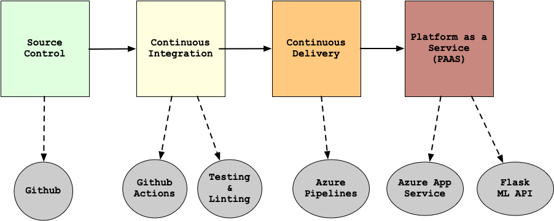
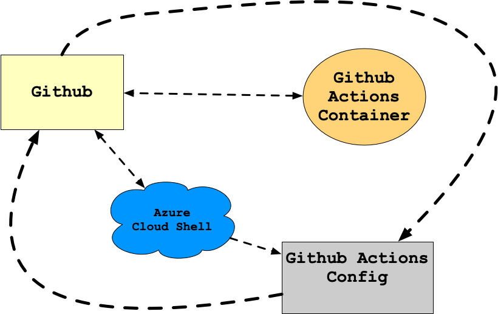
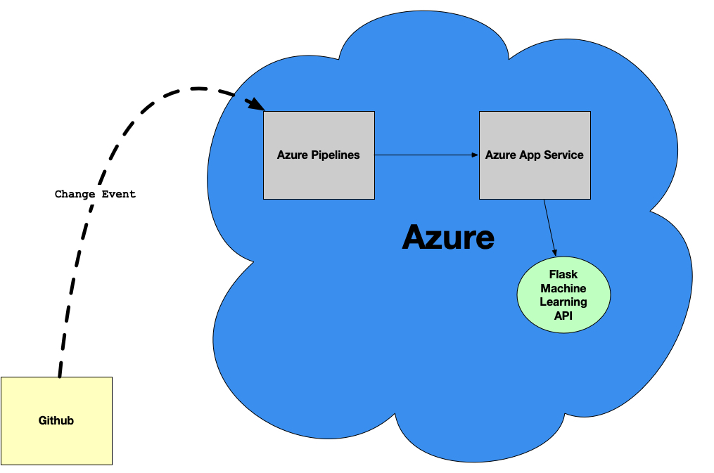
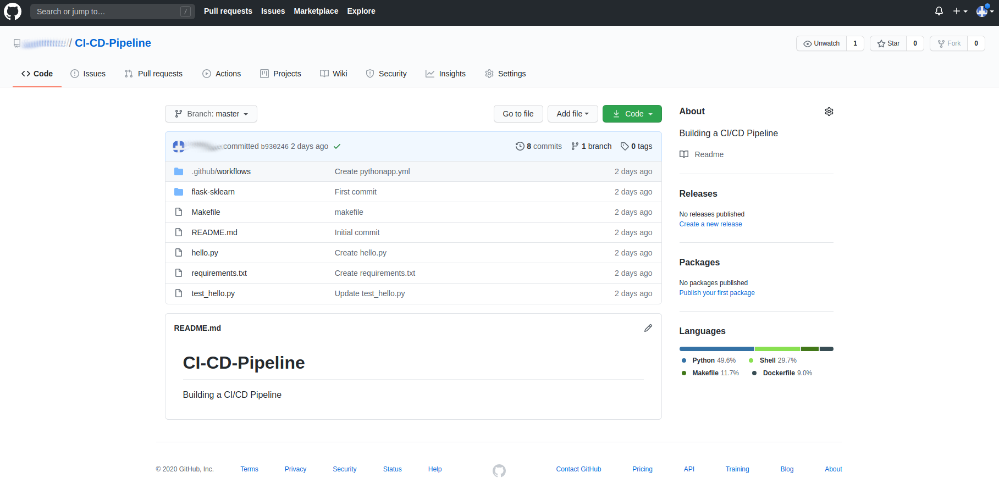
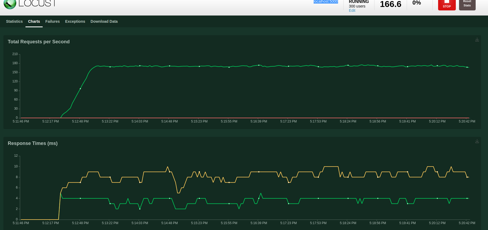
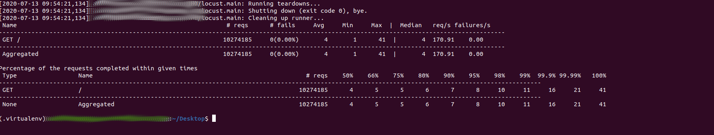

# Overview

<TODO: complete this with an overview of your project>
In this project, you will build a Github repository from scratch and create a scaffolding that will assist you in performing both Continuous Integration and Continuous Delivery. You'll use Github Actions along with a Makefile, requirements.txt and application code to perform an initial lint, test, and install cycle. Next, you'll integrate this project with Azure Pipelines to enable Continuous Delivery to Azure App Service.
This project will give you an opportunity to demonstrate your ability to perform continuous delivery for a Python-based machine learning application using the Flask web framework. You will apply the skills you have acquired in this course to operationalize a Machine Learning Microservice API.

You are given a pre-trained, sklearn model that has been trained to predict housing prices in Boston according to several features, such as average rooms in a home and data about highway access, teacher-to-pupil ratios, and so on. You can read more about the data, which was initially taken from Kaggle, on the data source site. This project tests your ability to operationalize a Python flask app—in a provided file, app.py—that serves out predictions (inference) about housing prices through API calls. This project could be extended to any pre-trained machine learning model, such as those for image recognition and data labeling.

## Project Plan
<TODO: Project Plan

* A link to a Trello board for the project

https://trello.com/b/jcOaNP2U/building-a-ci-cd-pipeline

* A link to a spreadsheet that includes the original and final project plan>

https://docs.google.com/spreadsheets/d/1dDnVLc5F-XBmlpZ7NaXT_HrK_NoLcEReeQa1xQ6OpaQ/edit?usp=sharing
## Instructions

<TODO:  
* Architectural Diagram (Shows how key parts of the system work)>

This is the overview of our complete project

We proceed to continuous integration with github actions

Finally this shows how the various parts come together in the continuous delivery module.

<TODO:  Instructions for running the Python project.  How could a user with no context run this project without asking you for any help.  Include screenshots with explicit steps to create that work. Be sure to at least include the following screenshots:

- First we create a github repo where we will keep our code.

- Next, we clone the code on azure cloud shell using ssh keys. We run `git clone 'ssh-link-of-repository'`

- We then setup github actions for our repository

- After github actions has be successfully set, we run `git pull` on the azure cloud shell to ensure continuous integration.

- We then run then `make all` command to check if test passed.

- Next, we setup our Azure App Service and publish using a `docker container`

- We now move to the `deployment center` to set up our pipeline with `github`, we chose the desired repository and we deploy.

- We will then run the command `./make_prediction.sh` on the cloud shell to see our prediction.

- Now we will create a `locustfile.py` file to simulate the number of loads on the app and observe how the app behaves.

## Enhancements

<TODO: A short description of how to improve the project in the future>

The project can be further used to detect differences between animal and human images.
We can filter an appropriate dataset and successfully predict the race of a human image (whether white, african-american, asians, or latino) based on skin color,
hair, eye color, etc.

## Demo 

<TODO: Add link Screencast on YouTube>

https://youtu.be/6BKku-E0e4k

